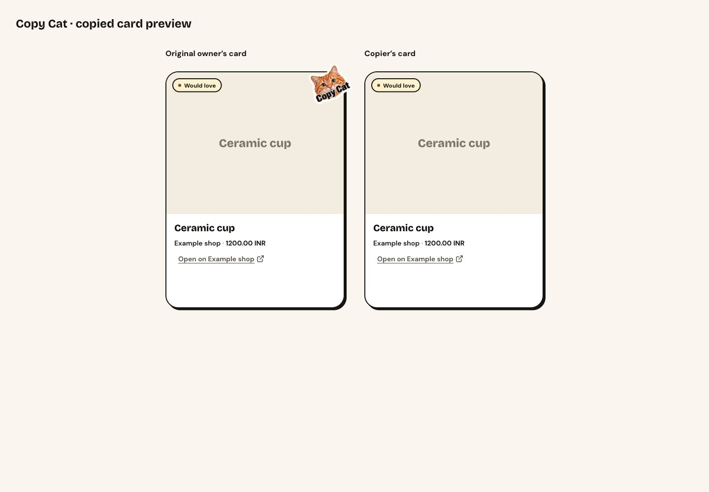
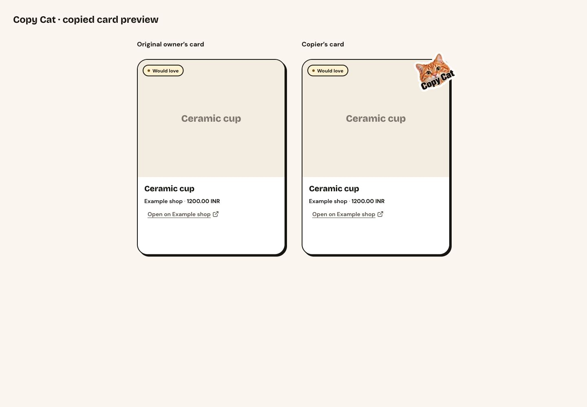
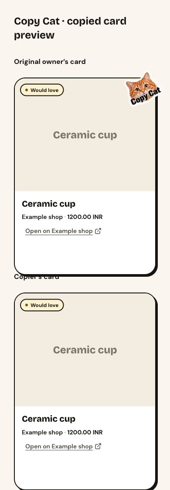
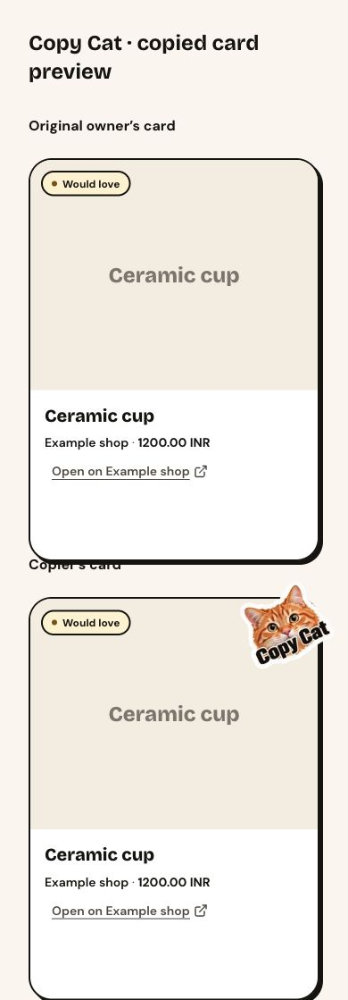

# Copy Cat ownership correction

Matched card-component comparison: same temporary local route `/test-support/copycat-preview`, same synthetic Ceramic cup, same copied state, at 1440×1000 and 390×844. Before uses the current main card components; after uses this branch. The temporary preview route is removed from the PR. No visual baselines were updated.

| Width | Before | After |
|---|---|---|
| Desktop |  |  |
| Mobile |  |  |

Only the copied destination receives the sticker. Its CSS footprint grows from 84×72 to 100×84, retaining the approved white border, top-right overflow, and −25° tilt. Owner cards retain an accessible edit link below the sticker.

Database change: deploy `20261027000000_group_copied_item_badges.sql` before the application. Missing projection data fails closed to no sticker. No table grant, RLS policy, or public-link projection changes. Existing copies use stored provenance automatically; source deletion retains the existing ON DELETE SET NULL behavior.

Rollback: revoke authenticated EXECUTE on `group_copied_item_ids(uuid, uuid)`, deploy the prior application, and drop the function in a follow-up migration. No production migration was applied during development.

Real local-stack browser journeys also passed at both widths. The production card views are recorded below (synthetic test users, automatically cleaned up).

| State | Desktop | Mobile |
|---|---|---|
| Copied source | [Desktop](wishlist-actions-copied-source-after-desktop.png) | [Mobile](wishlist-actions-copied-source-after-mobile.png) |
| Copier’s own wishlist | [Desktop](wishlist-actions-copied-destination-after-desktop.png) | [Mobile](wishlist-actions-copied-destination-after-mobile.png) |
