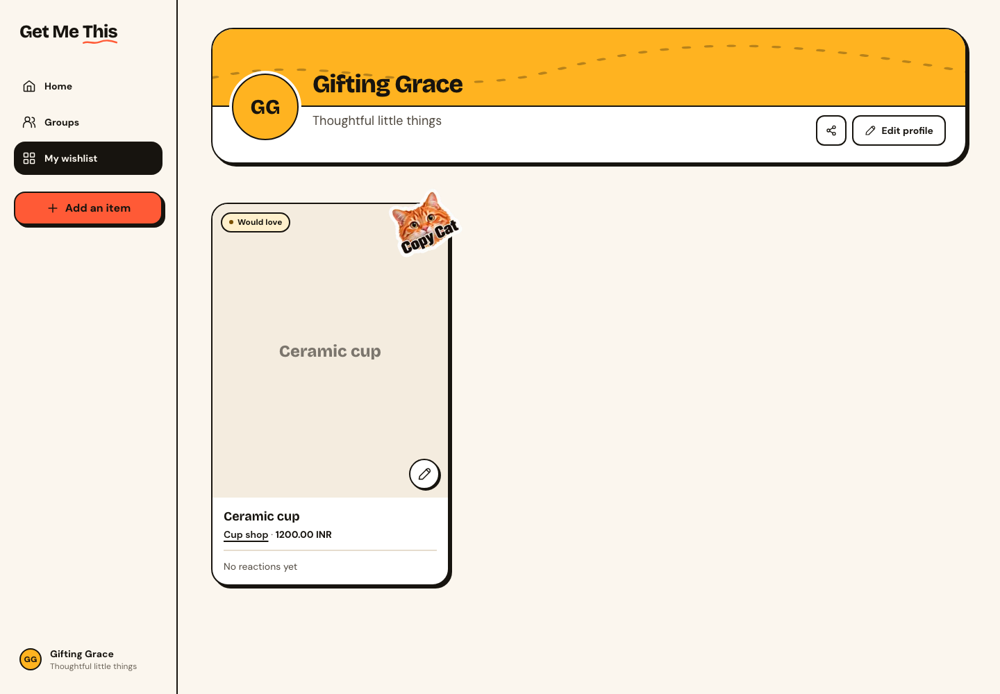
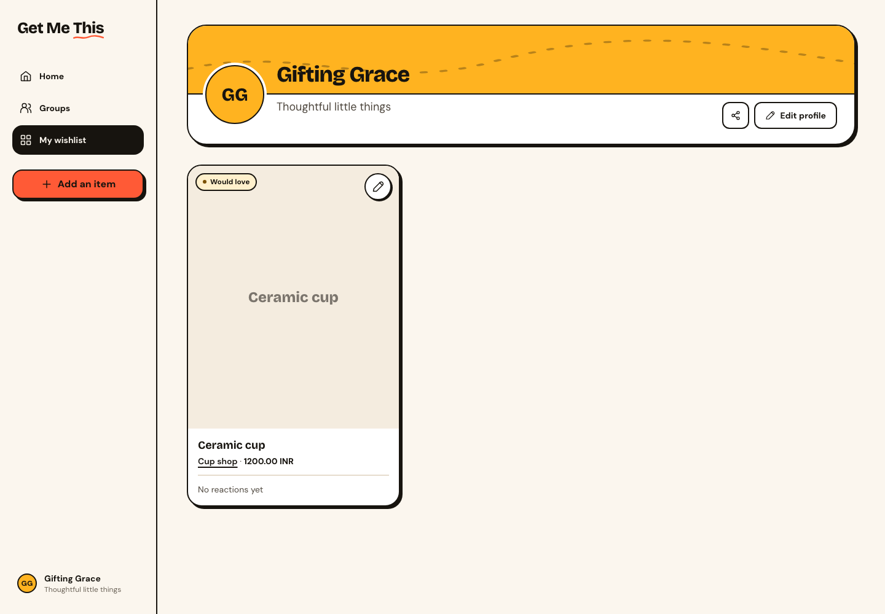
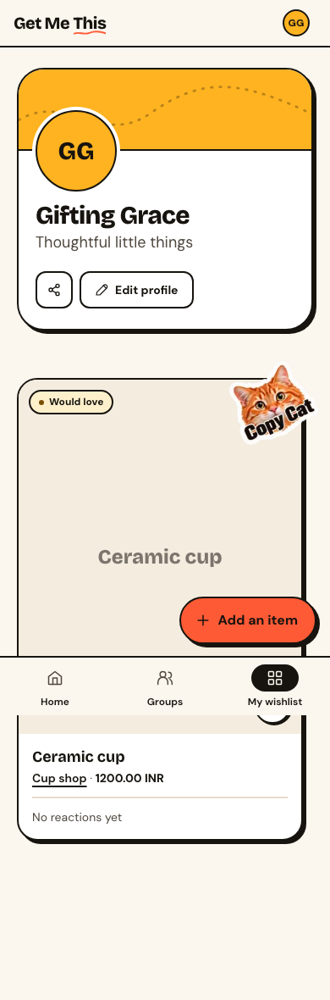
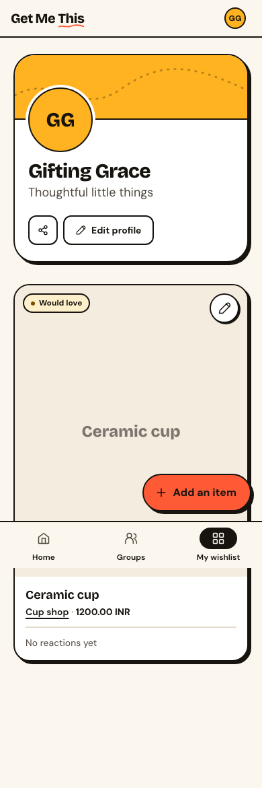

# Group-only Copy Cat stickers

Acceptance criteria from the user: “we don't need to show the copycat sticker on the public view/public sharing of the wish list, only within the group”.

- [x] Standalone wishlist omits the sticker even for a copied item: component regression and desktop/mobile copy journeys.
- [x] Public sharing omits the sticker: public-view regression; public projection and permissions unchanged.
- [x] Group room and another joined member’s view of the copier’s wishlist retain the sticker: desktop/mobile browser journeys.
- [x] Source cards and copy persistence remain correct: existing copy journeys pass.

Validation: `pnpm verify` passed (186 files, 1,819 tests and production build); four local-stack browser journeys passed. The initial interaction test followed the own-member route, which redirects to `/wishlist`; it now verifies the owner’s group-room card instead.

Matched screenshots use the same local copied Ceramic cup fixture at `/wishlist`, desktop 1440×1000 and mobile 390×844. Before images are the approved prior implementation; after images remove the sticker and restore the edit button to the image’s top right. No visual baselines changed.

| Viewport | Before | After |
| --- | --- | --- |
| Desktop |  |  |
| Mobile |  |  |

No migration is required. No Magic Patterns mock data or editor artifacts ship in the application. Railway preview is not configured; production deployment remains gated on green CI and independent review.
